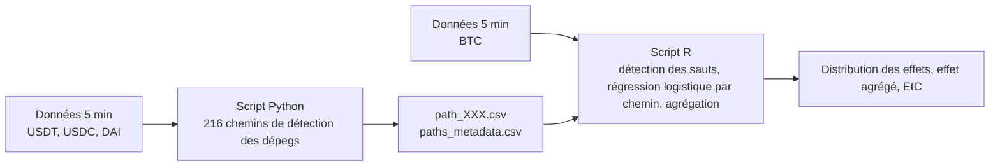

# stablecoin-depeg-forking-paths
Scripts de mon mémoire de master (UNamur) évaluant la robustesse de l'effet de contagion entre les dépegs de stablecoins (USDT, USDC, DAI) et les sauts du Bitcoin. Un script Python détecte les dépegs selon 216 chemins méthodologiques (forking paths, Coqueret 2023) et un script R estime l'effet sur chaque chemin puis agrège les résultats.

# Stablecoins, dépegs et sauts du Bitcoin : robustesse d'un effet de contagion par la méthodologie des forking paths
 
Ce dépôt rassemble les scripts développés dans le cadre de notre mémoire de master en sciences de gestion (Business Analysis & Integration) à l'Université de Namur, sous la direction du Prof. Jean-Yves Gnabo.
 
Nous y évaluons la sensibilité de l'effet de contagion entre les épisodes de dépeg de trois stablecoins (USDT, USDC et DAI) et les sauts significatifs du Bitcoin, mis en évidence dans notre précédent mémoire (Massaux, 2025), aux choix méthodologiques retenus. Pour cela, nous mobilisons la méthodologie des forking paths proposée par Coqueret (2023) en faisant varier systématiquement cinq opérations liées à la détection des épisodes de dépeg, dont la combinaison génère 216 chemins distincts. Le résultat initial se confirme pour l'USDT et le DAI, tandis que l'effet obtenu pour l'USDC apparaît dépendant du chemin retenu.
 
## Structure du dépôt
 
```
├── python/
│   ├── depeg_algo_forking_paths.py   # Génération des 216 chemins et détection des dépegs
│   ├── data_fetcher_kraken.py   # Script de récupération de données sur l'API de Kraken
│   └── README.md
└── R/
    ├── <script_R>.R                   # Estimation de l'effet sur chaque chemin et agrégation
    └── README.md
└── Results/
```
 
## Enchaînement des scripts
 

 
Le script Python identifie les épisodes de dépeg pour chacun des 216 chemins et exporte un fichier par chemin. Le script R fusionne ensuite ces fichiers avec les sauts détectés sur le Bitcoin, estime l'effet de contagion sur chaque chemin puis agrège les résultats. Le détail de chaque étape est présenté dans le README du dossier correspondant.
 
## Données
 
Les données utilisées ont une granularité de 5 minutes et couvrent la période du 1er janvier 2022 au 1er avril 2025. Elles proviennent de l'API de Coinbase pour le Bitcoin, l'USDT et le DAI, et de l'API de Kraken pour l'USDC. Elles ne sont pas incluses dans ce dépôt.
 
## Références principales
 
- Boudt, K., Croux, C., & Laurent, S. (2011). Robust estimation of intraweek periodicity in volatility and jump detection. *Journal of Empirical Finance*, 18(2), 353-367.
- Coqueret, G. (2023). *Forking paths in financial economics* (arXiv:2401.08606). https://doi.org/10.48550/arXiv.2401.08606
- Massaux, L. (2025). *Cartographie comparative des stablecoins* [Mémoire de master, Université de Namur].
- Perez Riaza, B., & Gnabo, J.-Y. (2024). *Spillover Effects of Tether Depegs on Bitcoin Jumps and Crypto-Asset Market Cojumps* (SSRN No 4996933).
## Auteur
 
Lorys Massaux, Université de Namur, 2025-2026
